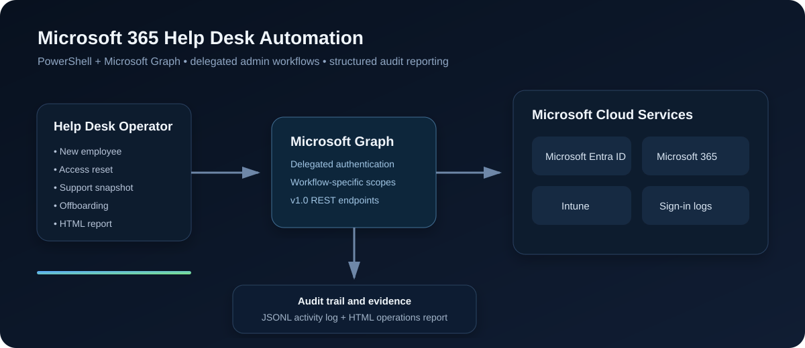
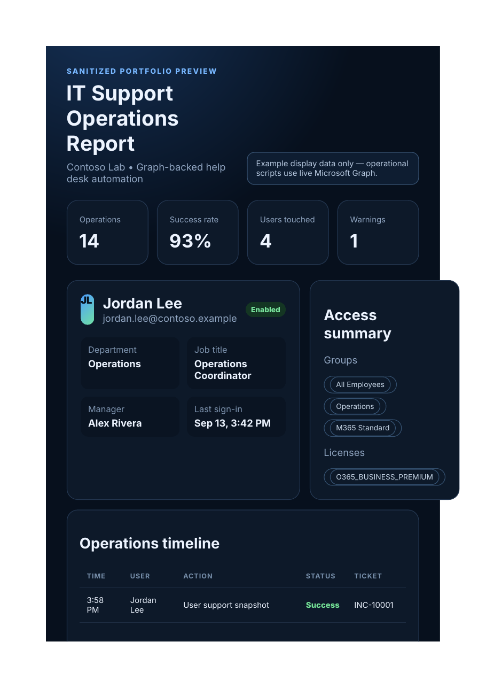

# Microsoft 365 Help Desk Automation

**PowerShell + Microsoft Graph automation for real Microsoft 365 / Microsoft Entra ID help-desk workflows.**

This project packages common Microsoft 365 support tasks into a small internal operations toolkit: user onboarding, offboarding, access recovery, support diagnostics, Intune/Entra device visibility, structured audit logging, and HTML reporting.

> **Graph-only execution:** the operational scripts authenticate to Microsoft Graph and work against the Microsoft 365 / Entra tenant you sign in to. There is no fake tenant execution path. Use only in a tenant where you are authorized to administer users and devices.

> **Start here:** follow [`START-HERE.md`](START-HERE.md) for installation, authentication, and initial testing.

<p align="center">
  
</p>

## Why I built it

Common Tier 1/2 workflows are repetitive: create the account, assign access, inspect user state, reset credentials, revoke sessions, document changes, and remove access during offboarding. This project demonstrates how those workflows can be standardized with **PowerShell and Microsoft Graph** while keeping operator safety and traceability in mind.

## Highlights

- Microsoft Graph delegated authentication with workflow-specific scopes
- Microsoft Entra ID user onboarding and lifecycle administration
- Optional group membership and Microsoft 365 license assignment
- Password reset, account enable/disable, and sign-in session revocation
- Help-desk support snapshots containing identity, manager, groups, license details, Entra registered devices, optional Intune managed devices, and optional sign-in activity
- Pre-offboarding evidence export before access changes
- Structured JSONL operation logging with ticket IDs, operator, tenant, target identity, status, and action details
- Filterable HTML **IT Support Operations Report**
- `SupportsShouldProcess` / `-WhatIf` on tenant-changing scripts
- Git protection for tenant-derived output and private input files
- Pester tests, PSScriptAnalyzer settings, and GitHub Actions quality checks

## Report preview

The image below is a **sanitized portfolio preview only**. The operational report script queries live Microsoft Graph data for the selected user and combines it with the toolkit's local operation trail.

<p align="center">
  
</p>

## Repository structure

```text
Microsoft-365-HelpDesk-Automation/
├── .github/
│   └── workflows/
│       └── powershell-quality.yml
├── config/
│   ├── README.md
│   └── sample-new-hires.csv
├── data/
│   ├── offboarding/
│   └── snapshots/
├── docs/
│   ├── assets/
│   │   ├── architecture.svg
│   │   ├── report-preview.html
│   │   └── report-preview.png
│   ├── GRAPH-PERMISSIONS.md
│   ├── SETUP-GUIDE.md
│   ├── TESTING.md
│   └── TROUBLESHOOTING.md
├── module/
│   ├── HelpDeskAutomation.psd1
│   └── HelpDeskAutomation.psm1
├── reports/
├── scripts/
│   ├── Install-Prerequisites.ps1
│   ├── Test-Prerequisites.ps1
│   ├── Test-GraphConnection.ps1
│   ├── New-Employee.ps1
│   ├── Offboard-Employee.ps1
│   ├── Get-UserSupportSnapshot.ps1
│   ├── Reset-UserAccess.ps1
│   └── Export-HelpDeskAudit.ps1
├── tests/
│   └── HelpDeskAutomation.Tests.ps1
├── .editorconfig
├── .gitignore
├── CHANGELOG.md
├── LICENSE
├── PSScriptAnalyzerSettings.psd1
├── SECURITY.md
└── README.md
```

## Quick start

### 1. Open the project in PowerShell 7

```powershell
cd C:\Path\To\Microsoft-365-HelpDesk-Automation
```

### 2. Install prerequisites

```powershell
.\scripts\Install-Prerequisites.ps1
.\scripts\Test-Prerequisites.ps1
```

The operational code uses `Microsoft.Graph.Authentication` and calls Graph through `Invoke-MgGraphRequest`.

### 3. Verify Microsoft Graph access

```powershell
.\scripts\Test-GraphConnection.ps1
```

Specific tenant:

```powershell
.\scripts\Test-GraphConnection.ps1 -TenantId 'YOUR-TENANT-ID'
```

Device-code authentication:

```powershell
.\scripts\Test-GraphConnection.ps1 -UseDeviceCode
```

The connection test displays the signed-in identity, tenant, and available license SKUs.

### 4. Start with a read-only support snapshot

```powershell
.\scripts\Get-UserSupportSnapshot.ps1 `
  -UserId 'user@yourtenant.com' `
  -TicketId 'INC-10001'
```

Include sign-in activity and Intune managed devices:

```powershell
.\scripts\Get-UserSupportSnapshot.ps1 `
  -UserId 'user@yourtenant.com' `
  -TicketId 'INC-10001' `
  -IncludeSignInActivity `
  -IncludeIntuneDevices
```

### 5. Preview write operations with `-WhatIf`

```powershell
.\scripts\Reset-UserAccess.ps1 `
  -UserId 'user@yourtenant.com' `
  -RevokeSessions `
  -TicketId 'INC-10002' `
  -WhatIf
```

```powershell
.\scripts\Offboard-Employee.ps1 `
  -UserId 'user@yourtenant.com' `
  -RemoveDirectGroupMemberships `
  -RemoveLicenses `
  -TicketId 'CHG-10020' `
  -WhatIf
```

## Scripts

| Script | Purpose | Tenant write? |
|---|---|---:|
| `Install-Prerequisites.ps1` | Installs Graph authentication and optional quality modules | No |
| `Test-Prerequisites.ps1` | Checks local PowerShell/module prerequisites | No |
| `Test-GraphConnection.ps1` | Authenticates and verifies tenant/license visibility | No |
| `Get-UserSupportSnapshot.ps1` | Pulls help-desk identity/access/device data | No |
| `New-Employee.ps1` | Creates Entra users, optional groups and licenses | **Yes** |
| `Reset-UserAccess.ps1` | Resets password, optional account enable/session revoke | **Yes** |
| `Offboard-Employee.ps1` | Captures evidence, disables account, revokes sessions, optional cleanup | **Yes** |
| `Export-HelpDeskAudit.ps1` | Creates a live-user HTML operations report | No |

## Onboard a new employee

Preview first:

```powershell
.\scripts\New-Employee.ps1 `
  -DisplayName 'Jordan Lee' `
  -UserPrincipalName 'jordan.lee@yourtenant.onmicrosoft.com' `
  -GivenName 'Jordan' `
  -Surname 'Lee' `
  -Department 'Operations' `
  -JobTitle 'Operations Coordinator' `
  -UsageLocation 'US' `
  -Groups 'All Employees' `
  -LicenseSkuPartNumbers 'O365_BUSINESS_PREMIUM' `
  -TicketId 'REQ-10010' `
  -WhatIf
```

Remove `-WhatIf` only when you are authorized and ready to make the change.

### CSV onboarding

Copy the included template to a private working file:

```powershell
Copy-Item .\config\sample-new-hires.csv .\config\new-hires.private.csv
```

Then:

```powershell
.\scripts\New-Employee.ps1 `
  -CsvPath .\config\new-hires.private.csv `
  -WhatIf
```

`Groups` and `LicenseSkuPartNumbers` accept semicolon-separated values.

## Reset user access

```powershell
.\scripts\Reset-UserAccess.ps1 `
  -UserId 'user@yourtenant.com' `
  -RevokeSessions `
  -TicketId 'INC-10002' `
  -WhatIf
```

Options:

- `-RevokeSessions` — invalidates current refresh tokens/session cookies through Microsoft Graph
- `-EnableAccount` — enables a currently disabled account
- `-NoForceChangePassword` — does not force password change at next sign-in
- `-NewTemporaryPassword` — optionally provide the temporary password; otherwise one is generated

Generated temporary passwords are displayed to the operator but are **not written to the local audit log**.

## Offboard an employee

```powershell
.\scripts\Offboard-Employee.ps1 `
  -UserId 'user@yourtenant.com' `
  -RemoveDirectGroupMemberships `
  -RemoveLicenses `
  -TicketId 'CHG-10020' `
  -WhatIf
```

Before tenant changes, the workflow exports current user/group/license evidence to `data/offboarding/`. Dynamic or protected memberships that cannot be removed are captured as warnings instead of being reported as successful.

When `-RemoveLicenses` is used, the script inspects Graph `licenseAssignmentStates` and removes only **directly assigned** user licenses. Group-inherited licenses are reported separately because they must be addressed through the assigning group.

## Generate the HTML operations report

```powershell
.\scripts\Export-HelpDeskAudit.ps1 `
  -UserId 'user@yourtenant.com' `
  -IncludeSignInActivity `
  -IncludeIntuneDevices
```

Output:

```text
reports\IT-Support-Operations-Report.html
```

The generated report is intentionally ignored by Git because it can contain tenant and user information.

## Microsoft Graph permissions

The project requests delegated scopes per workflow instead of relying on a single broad directory-write permission. Examples include:

- `User.Create` for user creation
- `User-PasswordProfile.ReadWrite.All` for password reset
- `User.EnableDisableAccount.All` + `User.Read.All` for account state changes
- `User.RevokeSessions.All` for session revocation
- `GroupMember.ReadWrite.All` for direct membership changes
- `LicenseAssignment.ReadWrite.All` for direct license assignment/removal
- `AuditLog.Read.All` for optional sign-in activity
- `DeviceManagementManagedDevices.Read.All` for optional Intune managed-device data

See **[docs/GRAPH-PERMISSIONS.md](docs/GRAPH-PERMISSIONS.md)** for the complete workflow map and Microsoft documentation links.

> Delegated Graph scopes do **not** replace Microsoft Entra administrative roles. The signed-in operator must also hold a role that authorizes the action.

## Safety model

- All tenant-changing scripts implement `SupportsShouldProcess` so you can use `-WhatIf`.
- Sensitive tenant output is excluded from Git by default.
- Temporary passwords are never written into the toolkit's local audit trail.
- Offboarding captures pre-change evidence before account disable/session revocation.
- The local JSONL log is a project operation trail, **not** a replacement for Microsoft Entra/Purview audit logging or a SIEM.
- Use a developer/test tenant before touching any real environment.

Read **[SECURITY.md](SECURITY.md)** before using the write workflows.

## Code quality

Install optional tools:

```powershell
.\scripts\Install-Prerequisites.ps1 -IncludeQualityTools
```

Run locally:

```powershell
Invoke-ScriptAnalyzer `
  -Path . `
  -Recurse `
  -Settings .\PSScriptAnalyzerSettings.psd1

Invoke-Pester .\tests
```

GitHub Actions runs static analysis and Pester tests on pushes and pull requests to `main`.

## Documentation

- **[Setup guide](docs/SETUP-GUIDE.md)** — machine-to-tenant setup from start to finish
- **[Testing guide](docs/TESTING.md)** — local validation, Pester workflow tests, and authorized test-tenant integration testing
- **[Graph permissions](docs/GRAPH-PERMISSIONS.md)** — scopes and official documentation
- **[Troubleshooting](docs/TROUBLESHOOTING.md)** — common Graph/tenant issues

## Project summary

> Built a PowerShell and Microsoft Graph help-desk automation toolkit for Microsoft 365 / Entra ID, automating user onboarding, offboarding, access recovery, account diagnostics, group/license workflows, Intune/Entra device visibility, structured audit logging, and HTML operations reporting with `-WhatIf` safety controls.

## Important limitations

- This is a lab project and has not been deployed in an employer production environment.
- The toolkit uses interactive delegated authentication; unattended/app-only automation would require a separate identity and credential/certificate design.
- Tenant features, licensing, administrative roles, Conditional Access, group type, and organizational policy can affect what Graph returns or permits.
- Optional Intune and sign-in data depend on the tenant having the appropriate services and access.

## License

MIT — see [LICENSE](LICENSE).

## Testing strategy

This repository has three test layers:

1. **Local repository validation** — `python .\tests\run-local-validation.py` checks required files, Graph-only contracts, expected scopes/endpoints, safety controls, Git exclusions, and basic PowerShell delimiter integrity. It is useful even on a machine where PowerShell quality modules are not installed.
2. **Pester + PowerShell AST tests** — `Invoke-Pester .\tests` parses the PowerShell files with the PowerShell AST and runs mocked workflow tests for onboarding, support snapshots, password/session recovery, offboarding, and HTML reporting without touching a tenant.
3. **Authorized test/developer tenant integration tests** — `tests\Invoke-TestTenantValidation.ps1` runs the read-only workflows against Microsoft Graph and can optionally exercise the complete disposable-user lifecycle when `-RunWriteTests` is explicitly supplied.

Read-only test-tenant validation:

```powershell
.\tests\Invoke-TestTenantValidation.ps1 `
  -ExistingTestUser 'test.user@contoso.onmicrosoft.com' `
  -TenantId 'YOUR-TENANT-ID'
```

Add Intune/sign-in checks when the tenant supports them:

```powershell
.\tests\Invoke-TestTenantValidation.ps1 `
  -ExistingTestUser 'test.user@contoso.onmicrosoft.com' `
  -TenantId 'YOUR-TENANT-ID' `
  -IncludeSignInActivity `
  -IncludeIntuneDevices
```

Full disposable-user lifecycle **only in an authorized test/developer tenant**:

```powershell
.\tests\Invoke-TestTenantValidation.ps1 `
  -ExistingTestUser 'test.user@contoso.onmicrosoft.com' `
  -TenantId 'YOUR-TENANT-ID' `
  -RunWriteTests `
  -TestDomain 'contoso.onmicrosoft.com'
```

You can additionally provide `-TestGroup` and `-LicenseSkuPartNumber` to verify group assignment/removal and licensing. Test results are written under `tests/results/`, which is ignored by Git except for `.gitkeep`.
